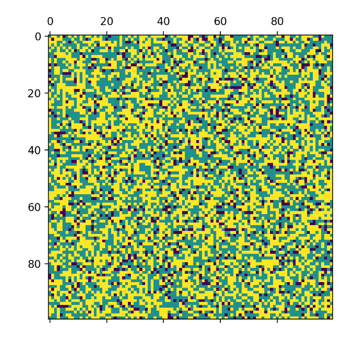
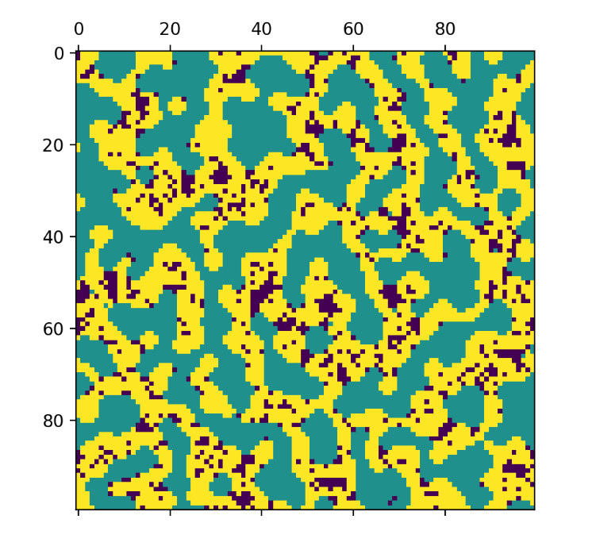

Understanding Segregation and Solution

## Summary

### What is Segregation?
Segregation refers to the separation of different groups in society, often seen in the context of residential patterns within cities. While racial and economic factors are commonly cited reasons, it's essential to understand that segregation can also stem from a more subtle force: unhappiness.

### The Role of Unhappiness in Driving Segregation
Thomas Schelling's seminal work, "Models of Segregation" (1971), provides a groundbreaking perspective on how individual preferences can lead to large-scale segregation. Schelling's model demonstrated that even a mild preference for neighbors of the same race or background can result in significant segregation. This phenomenon occurs not necessarily because of overt racism but because of the discomfort or unhappiness individuals feel when they are in the minority in their neighborhoods. Over time, these small preferences can cause significant clustering of groups, leading to segregated communities.

### Segregation in Major Cities
Segregation poses numerous challenges in major cities worldwide. It can lead to unequal access to resources, services, and opportunities, perpetuating cycles of poverty and social inequality. Segregated communities often experience disparities in education, healthcare, employment, and safety, contributing to broader societal divisions.

### Singapore's Approach to Solving Segregation
Singapore provides an interesting case study in addressing segregation. The city-state has implemented a series of policies aimed at promoting racial and social integration. One of the key strategies is the Ethnic Integration Policy (EIP), introduced in 1989. This policy sets quotas for different ethnic groups within public housing estates to ensure a balanced mix of residents from various backgrounds.

#### Key Features of Singapore's Ethnic Integration Policy:
- **Quotas in Public Housing:** The EIP mandates specific ethnic proportions in public housing, reflecting the national ethnic composition. This approach prevents the formation of ethnic enclaves and encourages diverse neighborhoods.
- **Community Programs:** Singapore also invests in community-building programs that foster interaction and understanding among residents from different backgrounds. These programs include cultural events, shared facilities, and initiatives promoting social cohesion.
- **Education and Outreach:** The government actively promotes multiculturalism through education and public campaigns, emphasizing the importance of diversity and inclusion in building a harmonious society.

### Python Project: Schelling's Segregation Model
In this small Python project, I've developed an interactive version of Schelling's Segregation Model. This model allows users to experiment with different parameters to observe how small preferences can lead to segregation over time. By adjusting parameters such as neighborhood size, tolerance levels, and the initial distribution of groups, users can see firsthand the dynamics that Schelling described.

#### Example Results from the Simulation:
Here are some example results from the simulation showcasing different results.

- **INITIALIZATION:**

- **SEGREGATION:**

### Conclusion
Understanding segregation and its underlying causes is crucial for developing effective solutions. Schelling's work highlights that segregation can result from individual preferences and feelings of unhappiness rather than overt racism. Major cities face significant challenges due to segregation, but Singapore's proactive approach provides valuable lessons. By implementing policies like the Ethnic Integration Policy and promoting community engagement, Singapore aims to create a more integrated and cohesive society.

### References
- Schelling, T. C. (1971). Dynamic Models of Segregation. *Journal of Mathematical Sociology*, 1(2), 143-186.
- Singapore Government. (1989). Ethnic Integration Policy.
